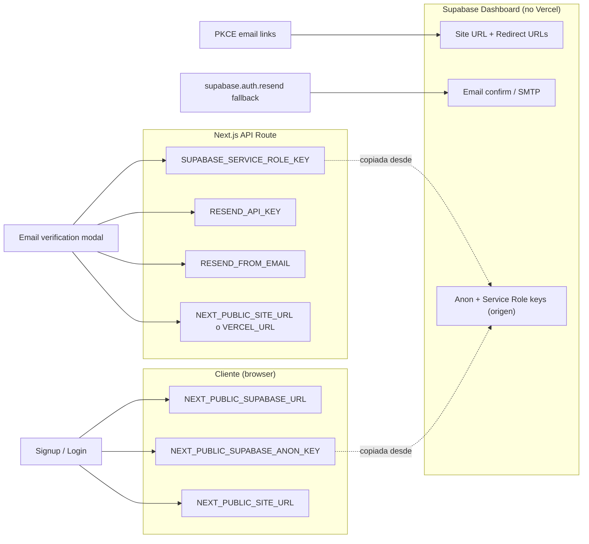

# NexoLearn — Auditoría de variables de entorno (Auth)

**Fase:** 1 — Producción  
**Fecha:** 2026-06-05 (actualizado 2026-06-07)  
**Alcance:** Flujo completo de autenticación en `frontend/` (app activa en `nexolearn.cl`)  
**Método:** Inspección de código, `.env.example`, `.env.local`, `vercel env ls` (proyecto `nexolearn/nexolearn`).  
**Sin modificaciones de código.**

---

## Resumen ejecutivo

| Pregunta | Respuesta |
|----------|-----------|
| ¿Cuántas variables requiere auth en producción? | **6 obligatorias** + 1 auto (Vercel) + configuración Supabase Dashboard |
| ¿Está completo el entorno local? | **No** — solo 2 de 6 en `.env.local` |
| ¿Se pudo verificar Vercel? | **Sí** — proyecto `nexolearn/nexolearn`, `vercel link` + `vercel env ls` (2026-06-07) |
| ¿Se pudo verificar Supabase Dashboard? | **No** — solo inferencia desde código y URL de proyecto local |
| **Riesgo principal** | En Vercel faltan `RESEND_API_KEY`, `RESEND_FROM_EMAIL` y `NEXT_PUBLIC_SITE_URL`. La API exige **service role + Resend**; sin Resend sigue el **503** y el fallback SMTP de Supabase no entrega a correos externos |

---

## 1. Variables requeridas por el flujo completo de auth

### 1.1 Mapa flujo → variables



### 1.2 Tabla detallada (`frontend/`)

| Variable | Obligatoria | Secreto | Usada en | Paso del flujo |
|----------|-------------|---------|----------|----------------|
| `NEXT_PUBLIC_SUPABASE_URL` | **Sí** | No (pública) | `lib/supabase.ts`, `lib/api-auth.ts`, `api/auth/send-confirmation/route.ts` | Registro, login, sesión, PKCE, API skills |
| `NEXT_PUBLIC_SUPABASE_ANON_KEY` | **Sí** | Semi (expuesta al cliente) | `lib/supabase.ts`, `lib/api-auth.ts` | Registro, login, sesión, Bearer en API routes |
| `NEXT_PUBLIC_SITE_URL` | **Sí en producción** | No | `lib/auth-redirect.ts` | Redirect en `signUp`, `resend`, enlaces de confirmación cliente |
| `SUPABASE_SERVICE_ROLE_KEY` | **Sí para email fiable** | **Sí** | `api/auth/send-confirmation/route.ts` | `admin.generateLink()` para enlace de confirmación |
| `RESEND_API_KEY` | **Sí para email fiable** | **Sí** | `api/auth/send-confirmation/route.ts` | Envío SMTP vía Resend |
| `RESEND_FROM_EMAIL` | Recomendada | No | `api/auth/send-confirmation/route.ts` | Remitente (default dev: `NexoLearn <onboarding@resend.dev>`) |
| `VERCEL_URL` | Auto en Vercel | No | `lib/auth-redirect.ts` → `getServerSiteUrl()` | Fallback si falta `NEXT_PUBLIC_SITE_URL` en server |

### 1.3 Variables **no** usadas por auth en `frontend/` (pero presentes en monorepo)

| Variable | App | Relación con auth |
|----------|-----|-------------------|
| `SUPABASE_URL` | `api/index.js` (legacy) | Duplicado de `NEXT_PUBLIC_SUPABASE_URL` |
| `SUPABASE_ANON_KEY` | `api/index.js` (legacy) | Duplicado de anon key |
| `SUPABASE_JWT_SECRET` | `apps/api` (Nest) | No usado por `frontend/` auth |
| `NEXT_PUBLIC_API_URL` | `apps/web` | No usado por `frontend/` auth |

### 1.4 Rutas que **no** dependen de env vars (usan `window.location.origin`)

| Ruta / acción | Archivo |
|---------------|---------|
| Recuperación de contraseña `redirectTo` | `app/forgot-password/page.tsx` |
| Login / logout / dashboard guards | Cliente Supabase + `getSession()` |

---

## 2. Variables que existen actualmente en el repositorio

### 2.1 `frontend/.env.example` (plantilla documentada)

```env
NEXT_PUBLIC_SUPABASE_URL=https://your-project.supabase.co
NEXT_PUBLIC_SUPABASE_ANON_KEY=your-anon-or-publishable-key
NEXT_PUBLIC_SITE_URL=https://nexolearn.cl

SUPABASE_SERVICE_ROLE_KEY=your-service-role-key
RESEND_API_KEY=re_your_resend_api_key
RESEND_FROM_EMAIL=NexoLearn <no-reply@your-domain.com>
```

**Estado:** Plantilla completa y alineada con el código actual.

### 2.2 `frontend/.env.local` (entorno local del desarrollador)

| Variable | Estado | Valor (enmascarado) |
|----------|--------|---------------------|
| `NEXT_PUBLIC_SUPABASE_URL` | ✅ Presente | `https://zipnptfx…pjv.supabase.co` |
| `NEXT_PUBLIC_SUPABASE_ANON_KEY` | ✅ Presente | `sb_publishable_PuLd…73Ry` |
| `NEXT_PUBLIC_SITE_URL` | ❌ Ausente | — |
| `SUPABASE_SERVICE_ROLE_KEY` | ❌ Ausente | — |
| `RESEND_API_KEY` | ❌ Ausente | — |
| `RESEND_FROM_EMAIL` | ❌ Ausente | — |

**Efecto local:** `npm run build` compila (las 2 vars públicas bastan para build). La ruta `/api/auth/send-confirmation` responde **503** → fallback a `supabase.auth.resend()`.

### 2.3 Otras apps del monorepo (no producción auth actual)

| Archivo | Variables auth |
|---------|----------------|
| `apps/web/.env.example` | Solo `NEXT_PUBLIC_SUPABASE_*` + `NEXT_PUBLIC_API_URL` — **sin** Resend ni service role |
| `apps/api/.env.example` | `SUPABASE_URL`, `SUPABASE_ANON_KEY`, `SUPABASE_JWT_SECRET` — stack Nest, no `frontend/` |

### 2.4 Archivos de entorno ausentes

- No hay `.env`, `.env.production`, ni `.env.vercel` en `frontend/`
- No hay `vercel.json` con env embebidas
- No hay `.vercel/project.json` commiteado (no se puede inferir project ID)

---

## 3. Variables que faltan

### 3.1 En local (`frontend/.env.local`)

| Variable faltante | Impacto |
|-------------------|---------|
| `NEXT_PUBLIC_SITE_URL` | En local funciona por fallback `window.location.origin`; en preview Vercel sin esta var, redirects de signup pueden apuntar al dominio `*.vercel.app` en lugar de `nexolearn.cl` |
| `SUPABASE_SERVICE_ROLE_KEY` | API send-confirmation → 503; sin `generateLink` server-side |
| `RESEND_API_KEY` | Mismo 503; sin envío Resend |
| `RESEND_FROM_EMAIL` | Usa default `onboarding@resend.dev` (solo válido en sandbox Resend) |

### 3.2 En producción (verificado en Vercel — 2026-06-07)

**Confirmado en Vercel:** `SUPABASE_SERVICE_ROLE_KEY` está configurada (Production, Preview, Development).

**Faltan en Vercel:**

| Variable | Estado |
|----------|--------|
| `RESEND_API_KEY` | ❌ **Ausente** |
| `RESEND_FROM_EMAIL` | ❌ **Ausente** |
| `NEXT_PUBLIC_SITE_URL` | ❌ **Ausente** |

El código en `send-confirmation/route.ts` exige **las tres**: `supabaseUrl` + `serviceRoleKey` + `resendApiKey`. Aunque el service role exista, **sin `RESEND_API_KEY` la API sigue devolviendo 503**:

1. Modal llama `POST /api/auth/send-confirmation`
2. Respuesta **503** `delivery_not_configured`
3. Cliente ejecuta `supabase.auth.resend()`
4. Supabase SMTP por defecto → correos externos **no autorizados** (`email address not authorized`)

### 3.3 Gap documentación raíz

`README.md` (raíz) documenta env vars para `apps/web` y `apps/api`, **no** para `frontend/` ni las vars Resend/service role.

---

## 4. Variables configuradas en Vercel

### 4.1 Estado de verificación

| Método | Resultado |
|--------|-----------|
| `vercel link` | ✅ Proyecto `nexolearn/nexolearn` vinculado a `frontend/` |
| `vercel env ls` | ✅ Ejecutado 2026-06-07 — 17 variables (valores encriptados) |
| `.vercel/project.json` en repo | No commiteado (local tras `vercel link`) |

### 4.2 Inventario Vercel (`nexolearn/nexolearn`)

Todas las variables listadas están en **Production, Preview y Development**.

#### Requeridas por auth — estado

| Variable | En Vercel | Auth |
|----------|-----------|------|
| `NEXT_PUBLIC_SUPABASE_URL` | ✅ | Usada por `frontend/` |
| `NEXT_PUBLIC_SUPABASE_ANON_KEY` | ✅ | Usada por `frontend/` |
| `SUPABASE_SERVICE_ROLE_KEY` | ✅ | Usada por `send-confirmation` |
| `NEXT_PUBLIC_SITE_URL` | ❌ | **Falta** |
| `RESEND_API_KEY` | ❌ | **Falta** — bloquea envío server-side |
| `RESEND_FROM_EMAIL` | ❌ | **Falta** |

#### Presentes en Vercel pero no usadas por `frontend/` auth

| Variable | Nota |
|----------|------|
| `SUPABASE_URL` | Duplicado legacy; código usa `NEXT_PUBLIC_SUPABASE_URL` |
| `SUPABASE_ANON_KEY` | Duplicado legacy |
| `NEXT_PUBLIC_SUPABASE_PUBLISHABLE_KEY` | Duplicado de anon/publishable |
| `SUPABASE_PUBLISHABLE_KEY` | Duplicado |
| `SUPABASE_SECRET_KEY` | No referenciada en `frontend/` |
| `SUPABASE_JWT_SECRET` | Nest/legacy, no `frontend/` |
| `POSTGRES_*` (7 vars) | Base de datos, no auth cliente |
| `MONGODB_URI` | No usada por auth `frontend/` |

### 4.3 Conclusión Vercel

| Variable | Production | Preview | Development |
|----------|------------|---------|-------------|
| `NEXT_PUBLIC_SUPABASE_URL` | ✅ | ✅ | ✅ |
| `NEXT_PUBLIC_SUPABASE_ANON_KEY` | ✅ | ✅ | ✅ |
| `SUPABASE_SERVICE_ROLE_KEY` | ✅ | ✅ | ✅ |
| `NEXT_PUBLIC_SITE_URL` | ❌ **añadir** | ❌ | opcional |
| `RESEND_API_KEY` | ❌ **añadir** | ❌ | ❌ |
| `RESEND_FROM_EMAIL` | ❌ **añadir** | ❌ | ❌ |

**Notas:**

- `SUPABASE_SERVICE_ROLE_KEY` ya está en Vercel; el cuello de botella de email es **`RESEND_API_KEY` ausente**.
- `VERCEL_URL` la inyecta Vercel; sin `NEXT_PUBLIC_SITE_URL`, `getServerSiteUrl()` puede usar `*.vercel.app` en algunos requests.
- Considerar eliminar duplicados (`SUPABASE_URL` vs `NEXT_PUBLIC_SUPABASE_URL`) para reducir confusión operativa.

---

## 5. Configuración en Supabase (Dashboard)

Las siguientes configuraciones **no son variables de Vercel** pero son **obligatorias** para auth. No se pudo leer el Dashboard desde este entorno.

### 5.1 Proyecto identificado (desde local)

| Campo | Valor |
|-------|-------|
| Project ref | `zipnptfxkmlxsbtfzpjv` |
| API URL | `https://zipnptfxkmlxsbtfzpjv.supabase.co` |

### 5.2 API Keys (Supabase → Settings → API)

| Key | Origen | Destino esperado |
|-----|--------|------------------|
| **anon / publishable** | Supabase | `NEXT_PUBLIC_SUPABASE_ANON_KEY` en Vercel + local |
| **service_role** | Supabase | `SUPABASE_SERVICE_ROLE_KEY` en Vercel (**nunca** en cliente) |

**Estado local:** anon key copiada a `.env.local`. Service role **no** presente en local.

### 5.3 Authentication → URL Configuration

| Setting | Valor recomendado producción | Usado por |
|---------|------------------------------|-----------|
| **Site URL** | `https://nexolearn.cl` | Links por defecto en emails Supabase |
| **Redirect URLs** | Ver lista abajo | PKCE `exchangeCodeForSession`, `signUp`, `resetPasswordForEmail` |

**Redirect URLs requeridas (allow list):**

```
https://nexolearn.cl/dashboard
https://nexolearn.cl/dashboard?setup=profile
https://nexolearn.cl/reset-password
https://nexolearn.cl/confirm-email
http://localhost:3000/dashboard
http://localhost:3000/dashboard?setup=profile
http://localhost:3000/reset-password
```

Si falta alguna URL, Supabase rechaza el redirect tras click en email → usuario no confirma.

### 5.4 Authentication → Email

| Setting | Requerido | Notas |
|---------|-----------|-------|
| Confirm email | **Habilitado** (si producto exige verificación) | Bloquea login según configuración |
| Email templates | Confirm signup + Reset password | Usados por fallback `auth.resend()` |
| Custom SMTP | Opcional si Resend cubre envío | Sin SMTP custom + sin Resend en Vercel = fallo en correos externos |

### 5.5 Relación Supabase ↔ Vercel (vars críticas)

| Variable Vercel | De dónde copiarla en Supabase |
|-----------------|-------------------------------|
| `NEXT_PUBLIC_SUPABASE_URL` | Project URL |
| `NEXT_PUBLIC_SUPABASE_ANON_KEY` | anon public / publishable key |
| `SUPABASE_SERVICE_ROLE_KEY` | service_role key (**secret**) |

| Variable Vercel | De dónde copiarla |
|-----------------|-------------------|
| `RESEND_API_KEY` | [Resend Dashboard](https://resend.com) → API Keys |
| `RESEND_FROM_EMAIL` | Dominio verificado en Resend (ej. `NexoLearn <no-reply@nexolearn.cl>`) |
| `NEXT_PUBLIC_SITE_URL` | Dominio canónico: `https://nexolearn.cl` (no Supabase) |

---

## 6. Atención especial — las 4 variables críticas

### 6.1 `NEXT_PUBLIC_SITE_URL`

| Aspecto | Detalle |
|---------|---------|
| **Código** | `lib/auth-redirect.ts` líneas 4-6 (cliente), 10-11 (servidor) |
| **Producción esperada** | `https://nexolearn.cl` |
| **Local** | ❌ Faltante — usa `http://localhost:3000` vía `window.location.origin` |
| **Vercel** | ❌ **Ausente** (verificado 2026-06-07) |
| **Riesgo sin ella** | En server, `getServerSiteUrl()` usa `VERCEL_URL` (`*.vercel.app`) o headers; enlaces en emails Resend pueden apuntar al dominio incorrecto si el request no trae `x-forwarded-host: nexolearn.cl` |

### 6.2 `SUPABASE_SERVICE_ROLE_KEY`

| Aspecto | Detalle |
|---------|---------|
| **Código** | `api/auth/send-confirmation/route.ts` líneas 76, 81-90, 93-98 |
| **Local** | ❌ Faltante |
| **Vercel** | ✅ **Presente** (Production, Preview, Development) |
| **Sin ella** | API responde **503**; no se genera `action_link` server-side |
| **Seguridad** | Solo server; nunca prefijo `NEXT_PUBLIC_` |

### 6.3 `RESEND_API_KEY`

| Aspecto | Detalle |
|---------|---------|
| **Código** | `api/auth/send-confirmation/route.ts` líneas 77, 81, 115-120 |
| **Local** | ❌ Faltante |
| **Vercel** | ❌ **Ausente** — **bloqueador actual** del envío server-side |
| **Sin ella** | 503 aunque `SUPABASE_SERVICE_ROLE_KEY` exista; fallback a Supabase SMTP |
| **Seguridad** | Solo server |

### 6.4 `RESEND_FROM_EMAIL`

| Aspecto | Detalle |
|---------|---------|
| **Código** | `api/auth/send-confirmation/route.ts` línea 79 |
| **Default** | `NexoLearn <onboarding@resend.dev>` (solo testing Resend) |
| **Local** | ❌ Faltante (usaría default) |
| **Vercel** | ❌ **Ausente** |
| **Producción** | Debe ser remitente de dominio verificado en Resend; sin verificación → 502 en envío |

---

## 7. Matriz consolidada

| Variable | Requerida auth | En `.env.example` | En `.env.local` | Vercel prod | Supabase |
|----------|----------------|-------------------|-----------------|-------------|----------|
| `NEXT_PUBLIC_SUPABASE_URL` | Sí | ✅ | ✅ | ✅ | Origen (Project URL) |
| `NEXT_PUBLIC_SUPABASE_ANON_KEY` | Sí | ✅ | ✅ | ✅ | Origen (anon key) |
| `NEXT_PUBLIC_SITE_URL` | Sí (prod) | ✅ | ❌ | ❌ | Site URL (paralelo) |
| `SUPABASE_SERVICE_ROLE_KEY` | Sí (email) | ✅ | ❌ | ✅ | Origen (service_role) |
| `RESEND_API_KEY` | Sí (email) | ✅ | ❌ | ❌ | N/A (Resend) |
| `RESEND_FROM_EMAIL` | Recomendada | ✅ | ❌ | ❌ | N/A (Resend) |
| `VERCEL_URL` | Auto fallback | — | — | Auto | N/A |

**Leyenda:** ✅ confirmado · ❌ ausente · ❓ no verificado

---

## 8. Acciones recomendadas (solo operativas, sin código)

### P0 — Vercel (Production)

1. Añadir `NEXT_PUBLIC_SITE_URL=https://nexolearn.cl`
2. ~~`SUPABASE_SERVICE_ROLE_KEY`~~ — **ya configurada** en Vercel
3. Añadir `RESEND_API_KEY` (**prioridad máxima** — sin ella la API sigue en 503)
4. Añadir `RESEND_FROM_EMAIL` con dominio verificado en Resend
5. Redeploy tras guardar variables

### P0 — Supabase Dashboard

1. Site URL = `https://nexolearn.cl`
2. Añadir todas las Redirect URLs de la sección 5.3
3. Confirmar email templates activos

### P1 — Local

Completar `frontend/.env.local` con las 4 vars faltantes (usar valores de dev/staging, nunca commitear).

### P1 — Documentación

Actualizar `README.md` raíz con la plantilla de `frontend/.env.example`.

### P2 — Verificación post-config

```bash
# En Vercel Dashboard o tras redeploy — comprobar respuesta (con email de prueba real):
# POST /api/auth/send-confirmation → 200 { ok: true, channel: "server" }
# NO debe devolver 503 delivery_not_configured
```

---

## 9. Referencias de código

| Archivo | Variables leídas |
|---------|------------------|
| `frontend/lib/supabase.ts` | `NEXT_PUBLIC_SUPABASE_URL`, `NEXT_PUBLIC_SUPABASE_ANON_KEY` |
| `frontend/lib/auth-redirect.ts` | `NEXT_PUBLIC_SITE_URL`, `VERCEL_URL` |
| `frontend/lib/api-auth.ts` | `NEXT_PUBLIC_SUPABASE_URL`, `NEXT_PUBLIC_SUPABASE_ANON_KEY` |
| `frontend/app/api/auth/send-confirmation/route.ts` | Todas las críticas + `NEXT_PUBLIC_SUPABASE_URL` |
| `frontend/lib/auth-email.ts` | Indirecto vía `getEmailConfirmationRedirectUrl()` |
| `frontend/app/signup/page.tsx` | Indirecto vía `getEmailConfirmationRedirectUrl()` |

---

## 10. Limitaciones de esta auditoría

- Vercel verificado vía CLI (`vercel env ls`); valores encriptados — solo se confirmó presencia/ausencia de nombres.
- No se accedió al Dashboard de Supabase.
- No se ejecutaron requests mutantes contra producción.
- No se confirmó si Preview/Development en Vercel tienen el mismo set que Production.
- El monorepo contiene `apps/web` y `api/` con esquemas de env distintos; **este informe aplica solo a `frontend/`** como app de auth en `nexolearn.cl`.

---

*Generado en Fase 1 — solo diagnóstico. Sin cambios de código.*
