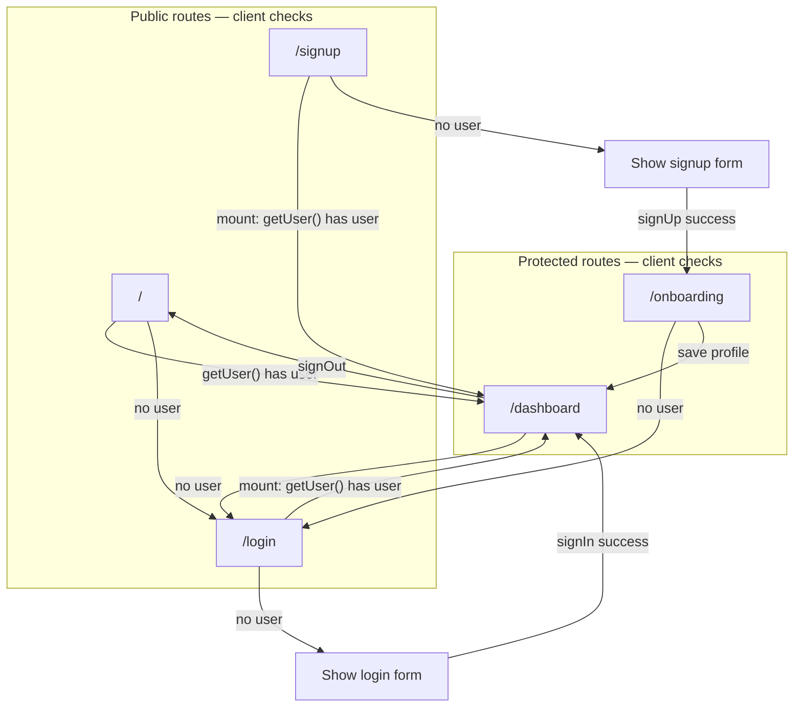

# NexoLearn — Authentication Redirect Audit

**Date:** 2026-06-04  
**Reported issue:** `https://nexolearn.cl/signup` redirects to `/dashboard`  
**Expected behavior:** Unauthenticated users can access `/`, `/login`, `/signup`; only authenticated users reach `/dashboard` and other protected routes.  
**Method:** Source-code trace of both `frontend/` and `apps/web`. No production network capture. No code modified.

---

## Executive summary

| Finding | Detail |
|---------|--------|
| **Root cause (most likely)** | `frontend/app/signup/page.tsx` runs `checkSession()` on mount; if Supabase returns a user, it calls `router.replace('/dashboard')`. |
| **Middleware** | **None** in the entire repository — no `middleware.ts` in `frontend/` or `apps/web/`. |
| **Protection model** | Client-side `useEffect` + `supabase.auth.getUser()` per page. |
| **Why it feels broken** | Users with a **persisted browser session** (even if they believe they are “logged out”) are treated as authenticated and bounced off `/signup`. |
| **Production app (likely)** | `frontend/` (per `DEPLOYMENT_AUDIT.md`, `nexolearn.cl` signup redesign). `apps/web` signup **does not** auto-redirect to dashboard on load. |

**Conclusion:** The redirect is **intentional in code** when a Supabase user exists. It is **incorrect relative to your stated product rule** only if you want `/signup` reachable while logged in, or if `getUser()` returns a user when the visitor considers themselves unauthenticated (stale session).

---

## 1. Current redirect flow

### `frontend/` (likely production: nexolearn.cl)



### Route-by-route table (`frontend/`)

| Route | On mount (unauthenticated) | On mount (authenticated) | After action |
|-------|---------------------------|--------------------------|--------------|
| `/` | → `/login` | → `/dashboard` | — |
| `/login` | Show form | → `/dashboard` | Sign in → `/dashboard` |
| `/signup` | Show form | → **`/dashboard`** | Sign up → `/onboarding` |
| `/dashboard` | → `/login` | Show dashboard | Sign out → `/` |
| `/onboarding` | → `/login` | Show onboarding | Save → `/dashboard` |

### `apps/web/` (monorepo canonical — different behavior)

| Route | On mount | Protection |
|-------|----------|------------|
| `/` | `session` → `/dashboard`, else → `/login` | `AuthContext` + `useAuth()` |
| `/login` | **No** auto-redirect if already logged in | Form only |
| `/signup` | **No** auto-redirect if already logged in | Form only |
| `/dashboard` | `!isAuthenticated` → `/login` | `useAuth()` in `useEffect` |
| `/onboarding/*` | Varies; `profile-setup` guards auth | Per-page `useEffect` |

`apps/web/next.config.ts` only redirects `/auth/login` → `/login` and `/auth/signup` → `/signup` (permanent). **No** `/signup` → `/dashboard` config redirect.

---

## 2. Middleware behavior

| Check | Result |
|-------|--------|
| `frontend/middleware.ts` | **Does not exist** |
| `apps/web/middleware.ts` | **Does not exist** |
| Root `middleware.ts` | **Does not exist** |
| `vercel.json` edge redirects | **Not in repo** |
| Next.js `redirects()` in config | Only `apps/web`: legacy `/auth/*` paths |

**Implication:** Vercel/Next **never** blocks or redirects `/signup` at the edge. All redirect logic runs **in the browser** after the page JavaScript loads.

**Gap vs expected behavior:** Protected routes are not enforced server-side. Unauthenticated users can briefly see protected HTML/JS until `useEffect` runs. Authenticated users hitting public routes are redirected only by client code (inconsistently between apps).

---

## 3. Supabase session checks

### `frontend/` — direct client, no AuthProvider

**Client:** `frontend/lib/supabase.ts`

```typescript
createClient(supabaseUrl, supabaseAnonKey)
// Default: persistSession true, autoRefreshToken true, localStorage
```

**Session API used on auth pages:**

| Page | API | When |
|------|-----|------|
| `/`, `/login`, `/signup` | `supabase.auth.getUser()` | `useEffect` on mount |
| `/dashboard`, `/onboarding` | `supabase.auth.getUser()` | `useEffect` on mount |

**Not used on `frontend/` auth pages:** `getSession()`, `onAuthStateChange()`, `AuthContext`.

**`getUser()` behavior:** Validates the JWT with Supabase Auth. If a valid session exists in browser storage (or refresh succeeds), `data.user` is set → signup/login redirect to `/dashboard`.

### `apps/web/` — AuthProvider

**Client:** Inline in `apps/web/lib/context/auth-context.tsx` (separate Supabase client instance).

| API | Usage |
|-----|--------|
| `getSession()` | Initial load in `AuthProvider` |
| `onAuthStateChange()` | Keeps `session` / `isAuthenticated` in sync |
| `signInWithPassword` / `signUp` / `signOut` | Auth actions |

**Signup page (`apps/web/app/auth/signup/page.tsx`):** Does **not** call `getUser()` or check `isAuthenticated` on mount — form always renders.

### Session persistence and the reported bug

Supabase stores session in **localStorage** (key pattern `sb-<project-ref>-auth-token`). Common scenarios where `/signup` → `/dashboard` happens for a “logged out” reporter:

1. **Session still active** — user logged in earlier on same browser; never clicked Sign out.
2. **Refresh token valid** — `getUser()` silently refreshes; user appears authenticated.
3. **Another tab** — session shared across tabs on `nexolearn.cl`.
4. **Sign out path inconsistency** — dashboard `signOut()` → `router.replace('/')` → if session not fully cleared, `/` → `/dashboard` loop possible (see §5).

**Truly no session:** `data.user` is `null` → signup form should render; **no** redirect to `/dashboard` in current code.

---

## 4. Why `/signup` redirects to `/dashboard`

### Primary mechanism (confirmed in source)

**File:** `frontend/app/signup/page.tsx`  
**Lines:** 16–27

```typescript
useEffect(() => {
  checkSession()
}, [])

async function checkSession() {
  const { data } = await supabase.auth.getUser()
  if (data.user) {
    router.replace('/dashboard')  // ← causes /signup → /dashboard
  } else {
    setLoading(false)
  }
}
```

**Same pattern on:** `frontend/app/login/page.tsx` (lines 16–27).

**Intent in code:** “Already signed-in users should not see signup/login again; send them to dashboard.”

**Conflict with reported expectation:** Product rule says unauthenticated users may access `/signup`. Code **allows** that. Code **blocks authenticated users** from `/signup` by redirecting to `/dashboard` — which matches the observed URL change if the browser has a valid Supabase user.

### Secondary paths to `/dashboard` (not on initial `/signup` load)

| Trigger | File | Condition |
|---------|------|-----------|
| Successful signup submit | `frontend/app/signup/page.tsx` ~L75 | `router.replace('/onboarding')` — not dashboard |
| Visit `/` while authenticated | `frontend/app/page.tsx` | `router.replace('/dashboard')` |
| Visit `/login` while authenticated | `frontend/app/login/page.tsx` | `router.replace('/dashboard')` |
| Complete onboarding | `frontend/app/onboarding/page.tsx` | `router.push('/dashboard')` |

None of these explain **immediate** `/signup` → `/dashboard` on first paint except **`checkSession()` finding a user**.

### If `apps/web` were deployed instead

`/signup` would **not** perform mount redirect to dashboard. A redirect on `nexolearn.cl/signup` strongly indicates **`frontend/`** bundle (or an old `frontend` build that re-exported combined auth with the same `checkSession`).

---

## 5. Exact files responsible

### Redirect to `/dashboard` from `/signup`

| Priority | File | Responsibility |
|----------|------|----------------|
| **P0** | `frontend/app/signup/page.tsx` | `checkSession()` → `router.replace('/dashboard')` when `data.user` exists |
| P1 | `frontend/lib/supabase.ts` | Supabase client; default session persistence enables cross-visit auth |
| P1 | `frontend/app/login/page.tsx` | Identical authenticated-user redirect (same pattern) |
| P2 | `frontend/app/page.tsx` | `/` → `/dashboard` when user exists (indirect: user may hit `/` after signup flow) |

### Protected route guards

| File | Guard |
|------|--------|
| `frontend/app/dashboard/page.tsx` | No user → `router.replace('/login')` |
| `frontend/app/onboarding/page.tsx` | No user → `router.push('/login')` |

### Sign out / session clear

| File | Behavior |
|------|----------|
| `frontend/app/dashboard/page.tsx` | `signOut()` → `router.replace('/')` (not `/login`) |
| `frontend/app/page.tsx` | If session remains after signOut race, `/` → `/dashboard` again |

### Not responsible (verified absent)

- `middleware.ts` — none
- `next.config.ts` redirects (`frontend/`) — empty config, no redirects
- `apps/web` signup page — no mount redirect to dashboard
- Vercel config in repo — none

### `apps/web` equivalents (if migration target)

| Concern | File |
|---------|------|
| Home redirect | `apps/web/app/page.tsx` |
| Login | `apps/web/app/auth/login/page.tsx` (redirect only after submit) |
| Signup | `apps/web/app/auth/signup/page.tsx` (**no** mount redirect) |
| Dashboard guard | `apps/web/app/dashboard/page.tsx` |
| Session state | `apps/web/lib/context/auth-context.tsx` |
| Path aliases | `apps/web/app/login/page.tsx`, `apps/web/app/signup/page.tsx` |
| Config redirects | `apps/web/next.config.ts` |

---

## 6. Gaps vs expected behavior

| Expected | Current `frontend/` | Gap |
|----------|---------------------|-----|
| Unauthenticated → `/signup` works | Yes (if `data.user` is null) | OK when no session |
| Unauthenticated → `/` accessible | `/` always redirects away | `/` is not a landing page; only redirect splash |
| Authenticated → `/dashboard` only | Partially | Authenticated users **can** still open `/onboarding` |
| Authenticated users blocked from `/signup` | Yes — redirected to dashboard | Matches code; **conflicts** if marketing wants signup while logged in |
| Server-enforced route protection | No | Flash of content; bypassable without JS |
| Consistent sign-out → public route | Weak | Sign out → `/` → may bounce back to dashboard if session lingers |

---

## 7. Recommended fix

Audit only — recommendations for implementation later.

### A. Immediate (fix `/signup` → `/dashboard` confusion)

1. **Decide product rule for authenticated visitors on `/signup`:**
   - **Option 1 (allow):** Remove `router.replace('/dashboard')` from `signup/page.tsx` (and optionally `login/page.tsx`). Show banner: “Signed in as {email}. [Go to dashboard] or [Sign out].”
   - **Option 2 (block with clarity):** Keep redirect but use intermediate page or query: `/dashboard?from=signup` with toast “You’re already signed in.”

2. **Align sign out:** After `signOut()`, use `router.replace('/login')` and `await supabase.auth.signOut()` before navigate; clear loading state.

3. **Verify production session:** On `nexolearn.cl`, DevTools → Application → Local Storage → remove `sb-*-auth-token` → reload `/signup`. If form appears, issue was **persisted session**, not unauthenticated redirect bug.

### B. Structural (match expected auth model)

4. **Add `middleware.ts`** (in the deployed app root — `frontend/` or `apps/web`):

   - **Public:** `/`, `/login`, `/signup` (and static assets)
   - **Protected:** `/dashboard`, `/onboarding`, `/admin`, etc.
   - Use `@supabase/ssr` `createServerClient` + cookie session (not only `getUser()` in client `useEffect`)

5. **Single auth layer:** Replace per-page `checkSession()` duplicates with one provider or middleware-backed session.

6. **Public `/` landing:** If `/` must be accessible unauthenticated, stop auto-redirect to `/login`; show marketing + CTAs to `/login` and `/signup`.

### C. Consolidation

7. **One frontend on Vercel** — merge redirect rules into `apps/web` or deploy only `frontend/`; document in `DEPLOYMENT_AUDIT.md` to avoid divergent auth behavior.

### Suggested middleware policy (spec)

```
Public (no auth required):
  /, /login, /signup

Protected (auth required):
  /dashboard, /onboarding, /onboarding/*

Authenticated user on /login or /signup:
  → redirect /dashboard (only if you keep “no auth pages when logged in”)

Unauthenticated user on protected:
  → redirect /login?next=<path>
```

---

## 8. Verification checklist (production)

| Step | Action | Pass criterion |
|------|--------|----------------|
| 1 | Incognito window → `https://nexolearn.cl/signup` | Signup form visible; URL stays `/signup` |
| 2 | Logged-in browser → `/signup` | Document intended behavior (form vs redirect) |
| 3 | Incognito → `/dashboard` | Redirect to `/login` (or `/`) |
| 4 | Network tab on `/signup` load | No 308/307 to `/dashboard` from server (client-only redirect if any) |
| 5 | Application → Local Storage | Confirm `sb-*-auth-token` presence correlates with redirect |

---

## 9. References

- `docs/DEPLOYMENT_AUDIT.md` — which app likely serves `nexolearn.cl`
- `docs/UI_AUDIT_V1.md` — signup URL/content issues
- `frontend/app/signup/page.tsx` — primary redirect source
- `frontend/lib/supabase.ts` — session client

---

**Audit conclusion:** `/signup` → `/dashboard` is caused by **client-side `checkSession()` in `frontend/app/signup/page.tsx`** when Supabase `getUser()` returns a user. There is **no middleware**. Unauthenticated access to `/signup` already works in code when no session exists; production reports usually indicate an **active or stale Supabase session** or testing while logged in. Recommended fix: add middleware-based public/protected routes, clarify authenticated-user behavior on signup, and consolidate on one frontend.
