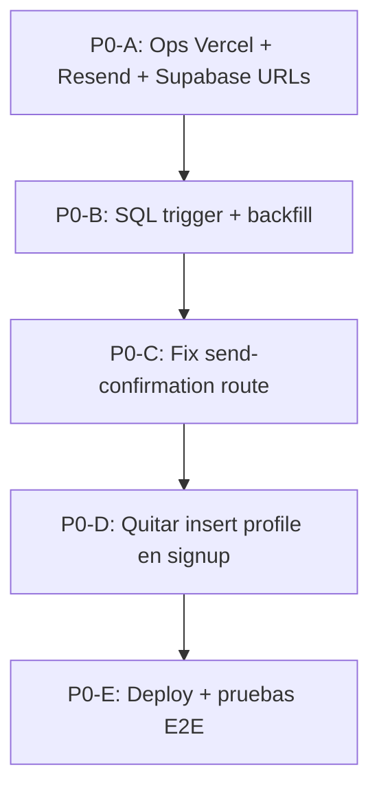

# NexoLearn — Plan de corrección Auth P0 (Fase 3)

**Fecha:** 2026-06-07  
**Fuentes:** Auditoría forense auth (jun-2026), `docs/AUTH_ENV_AUDIT.md`, `docs/AUTH_REDIRECT_AUDIT.md`  
**Alcance:** `frontend/` en producción (`nexolearn.cl`)  
**Regla:** plan de ejecución únicamente — **sin cambios de código en esta fase**

---

## Objetivos P0

| # | Objetivo | Estado actual |
|---|----------|---------------|
| 1 | Activar verificación de email real con Resend | API devuelve **503** — falta `RESEND_API_KEY` en Vercel |
| 2 | Corregir tipo de enlace en `send-confirmation` | Usa `magiclink`; debería ser `signup` para confirmación de registro |
| 3 | Crear trigger `handle_new_user()` | No existe en migraciones del repo |
| 4 | Eliminar creación de profile desde cliente en signup | `signup/page.tsx` inserta con RLS frágil (sin sesión garantizada) |
| 5 | Compatibilidad con usuarios existentes | Requiere backfill + `ON CONFLICT DO NOTHING` |

---

## Orden de ejecución recomendado



**Principio:** primero infraestructura (vars + DB), luego código. El trigger debe existir **antes** de quitar el insert cliente.

---

## P0-A — Infraestructura (sin código)

### Cambio A1: Variables en Vercel

| Campo | Valor |
|-------|-------|
| **Archivo** | Vercel Dashboard → `nexolearn/nexolearn` → Environment Variables |
| **Impacto** | Habilita `POST /api/auth/send-confirmation` → 200 con canal `server` |
| **Riesgo** | Bajo — solo añade config; `SUPABASE_SERVICE_ROLE_KEY` ya existe |
| **Rollback** | Eliminar las 3 vars añadidas; redeploy → vuelve 503 + fallback Supabase |

**Acciones:**

| Variable | Valor | Entornos |
|----------|-------|----------|
| `RESEND_API_KEY` | API key de Resend | Production, Preview, Development |
| `RESEND_FROM_EMAIL` | `NexoLearn <no-reply@nexolearn.cl>` (dominio verificado) | Production, Preview |
| `NEXT_PUBLIC_SITE_URL` | `https://nexolearn.cl` | Production, Preview |

Redeploy obligatorio tras guardar.

---

### Cambio A2: Configuración Supabase Dashboard

| Campo | Valor |
|-------|-------|
| **Archivo** | Supabase → Authentication → URL Configuration |
| **Impacto** | PKCE y redirects tras click en email no fallan por URL no permitida |
| **Riesgo** | Bajo |
| **Rollback** | Restaurar lista anterior de Redirect URLs |

**Site URL:** `https://nexolearn.cl`

**Redirect URLs (añadir si faltan):**

```
https://nexolearn.cl/dashboard
https://nexolearn.cl/dashboard?setup=profile
https://nexolearn.cl/reset-password
https://nexolearn.cl/confirm-email
http://localhost:3000/dashboard
http://localhost:3000/dashboard?setup=profile
http://localhost:3000/reset-password
```

---

### Cambio A3: Dominio en Resend

| Campo | Valor |
|-------|-------|
| **Archivo** | Resend Dashboard → Domains |
| **Impacto** | `RESEND_FROM_EMAIL` con dominio propio; evita 502 en envío |
| **Riesgo** | Medio — DNS puede tardar en propagar |
| **Rollback** | Usar temporalmente `onboarding@resend.dev` solo en Development |

---

### Cambio A4: Entorno local (desarrollo)

| Campo | Valor |
|-------|-------|
| **Archivo** | `frontend/.env.local` (no commitear) |
| **Impacto** | Permite probar flujo Resend antes de deploy |
| **Riesgo** | Bajo |
| **Rollback** | Borrar vars locales |

Copiar plantilla de `frontend/.env.example` (6 vars).

---

## P0-B — Base de datos: trigger `handle_new_user()`

### Cambio B1: Nueva migración SQL

| Campo | Valor |
|-------|-------|
| **Archivo** | `api/migrations/2026-06-07-handle-new-user.sql` (nuevo) |
| **Ejecutar en** | Supabase SQL Editor (producción) |
| **Impacto** | Cada nuevo `auth.users` obtiene fila en `profiles` automáticamente, sin depender del cliente |
| **Riesgo** | Medio — trigger en `auth.users` es irreversible sin script explícito |
| **Rollback** | Ver sección Rollback B1 al final de este cambio |

**Contenido propuesto (especificación, no aplicar aún):**

```sql
-- Función: crea profile stub al registrar usuario
CREATE OR REPLACE FUNCTION public.handle_new_user()
RETURNS TRIGGER
LANGUAGE plpgsql
SECURITY DEFINER
SET search_path = public
AS $$
BEGIN
  INSERT INTO public.profiles (id, email)
  VALUES (
    NEW.id,
    COALESCE(NULLIF(TRIM(NEW.email), ''), NEW.id::text || '@unknown.local')
  )
  ON CONFLICT (id) DO NOTHING;
  RETURN NEW;
END;
$$;

-- Trigger
DROP TRIGGER IF EXISTS on_auth_user_created ON auth.users;
CREATE TRIGGER on_auth_user_created
  AFTER INSERT ON auth.users
  FOR EACH ROW
  EXECUTE FUNCTION public.handle_new_user();
```

**Notas de diseño:**

- `ON CONFLICT (id) DO NOTHING` → usuarios existentes con profile no se duplican.
- `SECURITY DEFINER` → bypass RLS para insert server-side (patrón estándar Supabase).
- `email` desde `NEW.email` — coherente con signup actual.
- No inserta `full_name` / `first_name` — el dashboard los completa después.

---

### Cambio B2: Backfill usuarios existentes sin profile

| Campo | Valor |
|-------|-------|
| **Archivo** | Mismo archivo de migración o `api/migrations/2026-06-07-backfill-profiles.sql` |
| **Impacto** | Usuarios históricos sin fila en `profiles` quedan compatibles con skills/goals FK |
| **Riesgo** | Bajo — solo INSERT faltantes |
| **Rollback** | No eliminar filas creadas (datos válidos); si necesario, DELETE manual por audit log |

**SQL propuesto:**

```sql
INSERT INTO public.profiles (id, email)
SELECT
  u.id,
  COALESCE(NULLIF(TRIM(u.email), ''), u.id::text || '@unknown.local')
FROM auth.users u
LEFT JOIN public.profiles p ON p.id = u.id
WHERE p.id IS NULL
ON CONFLICT (id) DO NOTHING;
```

**Pre-check (ejecutar antes del backfill):**

```sql
SELECT COUNT(*) AS users_without_profile
FROM auth.users u
LEFT JOIN public.profiles p ON p.id = u.id
WHERE p.id IS NULL;
```

---

### Rollback B1

```sql
DROP TRIGGER IF EXISTS on_auth_user_created ON auth.users;
DROP FUNCTION IF EXISTS public.handle_new_user();
```

El backfill **no** se revierte automáticamente (filas creadas son datos legítimos).

---

## P0-C — Corregir `send-confirmation/route.ts`

### Cambio C1: Tipo de enlace `magiclink` → `signup`

| Campo | Valor |
|-------|-------|
| **Archivo** | `frontend/app/api/auth/send-confirmation/route.ts` |
| **Línea aprox.** | 51-55 (`admin.auth.admin.generateLink`) |
| **Impacto** | Enlaces de confirmación alineados con flujo de registro; `email_confirmed_at` se actualiza correctamente al hacer click |
| **Riesgo** | Medio — cambio en producción afecta todos los reenvíos; probar con cuenta de prueba |
| **Rollback** | Revertir commit; redeploy; volver a `type: 'magiclink'` |

**Cambio propuesto:**

```typescript
// Antes
type: 'magiclink',

// Después
type: 'signup',
```

**Fallback opcional (P0.1, si `signup` falla para cuentas edge-case):**

Intentar `signup` primero; si `error` o sin `action_link`, intentar `magiclink` como segundo intento y registrar cuál se usó en respuesta (`channel: 'server-signup' | 'server-magiclink'`). Solo si la prueba E2E lo exige.

---

### Cambio C2: Mensaje 503 más explícito (opcional P0)

| Campo | Valor |
|-------|-------|
| **Archivo** | `frontend/app/api/auth/send-confirmation/route.ts` |
| **Línea aprox.** | 81-90 |
| **Impacto** | Operaciones distingue “falta Resend” vs “falta service role” |
| **Riesgo** | Bajo |
| **Rollback** | Revertir mensaje |

Separar checks: si falta solo `RESEND_API_KEY`, mensaje específico. No bloquea funcionalidad.

---

### Cambio C3: Sin cambio en `auth-email.ts` (mantener fallback)

| Campo | Valor |
|-------|-------|
| **Archivo** | `frontend/lib/auth-email.ts` |
| **Impacto** | Si API falla, sigue `supabase.auth.resend()` — degradación controlada |
| **Riesgo** | Ninguno en P0 |
| **Rollback** | N/A |

Tras P0-A, el fallback debería ejecutarse raramente.

---

## P0-D — Eliminar creación de profile desde cliente

### Cambio D1: Quitar insert en signup

| Campo | Valor |
|-------|-------|
| **Archivo** | `frontend/app/signup/page.tsx` |
| **Línea aprox.** | 94-105 |
| **Impacto** | Signup ya no depende de sesión activa ni RLS para crear profile; trigger DB asume la responsabilidad |
| **Riesgo** | **Alto si se despliega antes del trigger** — nuevos usuarios sin profile |
| **Rollback** | Restaurar bloque `profiles.insert` |

**Prerequisito obligatorio:** P0-B aplicado en Supabase producción **antes** de deploy de este cambio.

**Código a eliminar:**

```typescript
if (user && !duplicateSignup) {
  const { error: profileError } = await supabase.from('profiles').insert([...])
  if (profileError) console.error(profileError)
}
```

Mantener: `goToDashboardVerify(email)`, manejo de `duplicateSignup`, `signUp` con `emailRedirectTo`.

---

### Cambio D2: Mantener `profile.ts` insert como upsert de datos (no eliminar)

| Campo | Valor |
|-------|-------|
| **Archivo** | `frontend/lib/profile.ts` |
| **Línea aprox.** | 206-218 (`tryProfileWrites` insert path) |
| **Impacto** | `ProfileBasicsEditor` / guardar nombre sigue funcionando si profile ya existe (UPDATE) o como red de seguridad (INSERT) |
| **Riesgo** | Bajo — path secundario; trigger ya creó stub |
| **Rollback** | N/A — no se modifica en P0 |

**Decisión:** no eliminar insert en `saveProfileBasics` — compatibilidad con usuarios existentes y edge cases post-trigger.

---

## P0-E — Deploy y verificación

### Cambio E1: Deploy `frontend/`

| Campo | Valor |
|-------|-------|
| **Archivo** | Vercel deploy desde `frontend/` |
| **Impacto** | Código + vars en producción |
| **Riesgo** | Medio |
| **Rollback** | Redeploy commit anterior en Vercel |

---

### Cambio E2: Checklist de pruebas E2E

| # | Prueba | Resultado esperado |
|---|--------|-------------------|
| 1 | `POST /api/auth/send-confirmation` con email registrado sin confirmar | `200 { ok: true, channel: "server" }` |
| 2 | Signup usuario nuevo (email limpio) | Redirect `/dashboard?verify=1`; modal auto-envía |
| 3 | Click enlace email | `/dashboard?setup=profile`; `email_confirmed_at` poblado |
| 4 | Query `SELECT * FROM profiles WHERE email = ?` tras signup | Fila existe **sin** insert cliente |
| 5 | Usuario existente con profile | Login + dashboard sin regresión |
| 6 | Usuario existente sin profile (pre-backfill) | Backfill + login OK |
| 7 | Refresh `/dashboard` con sesión | Sesión persiste |
| 8 | Logout | Redirect `/login`; localStorage limpio |

---

## Matriz de cambios (resumen)

| ID | Archivo / destino | Tipo | Impacto | Riesgo | Rollback |
|----|-------------------|------|---------|--------|----------|
| A1 | Vercel env vars | Ops | Email real activo | Bajo | Quitar vars |
| A2 | Supabase URL config | Ops | Redirects PKCE OK | Bajo | URLs anteriores |
| A3 | Resend domain | Ops | From address válido | Medio | Dominio dev Resend |
| A4 | `frontend/.env.local` | Ops local | Dev parity | Bajo | Borrar vars |
| B1 | `api/migrations/2026-06-07-handle-new-user.sql` | SQL | Profile auto en signup | Medio | Drop trigger + function |
| B2 | Backfill SQL | SQL | Usuarios legacy OK | Bajo | No revertir datos |
| C1 | `send-confirmation/route.ts` | Código | Enlace confirmación correcto | Medio | Git revert |
| C2 | `send-confirmation/route.ts` | Código (opt) | Mejor diagnóstico 503 | Bajo | Git revert |
| D1 | `signup/page.tsx` | Código | Sin insert cliente | **Alto** sin B1 | Restaurar insert |
| D2 | `profile.ts` | Sin cambio P0 | Compatibilidad guardada | — | — |
| E1 | Vercel deploy | Ops | Producción actualizada | Medio | Redeploy anterior |

---

## Compatibilidad con usuarios existentes

| Escenario | Estrategia |
|-----------|------------|
| Usuario con profile completo | `ON CONFLICT DO NOTHING` en trigger; sin cambios UX |
| Usuario con auth pero sin profile | Backfill B2 antes de quitar insert cliente |
| Usuario con email ya confirmado | Flujo login/dashboard sin cambios |
| Reenvío confirmación | API Resend con `type: 'signup'` |
| Skills/goals FK a `profiles` | Backfill garantiza fila padre |

---

## Criterios de éxito P0

- [ ] `vercel env ls` incluye `RESEND_API_KEY`, `RESEND_FROM_EMAIL`, `NEXT_PUBLIC_SITE_URL`
- [ ] `POST /api/auth/send-confirmation` → 200 en producción
- [ ] Correo llega a bandeja real (no solo sandbox)
- [ ] Click confirma cuenta y abre dashboard con setup profile
- [ ] Nuevo signup crea profile vía trigger (verificado en SQL)
- [ ] Ningún usuario en `auth.users` queda sin fila en `profiles` tras backfill
- [ ] Usuarios existentes acceden sin regresión

---

## Fuera de alcance P0 (P1+)

Documentar para fases posteriores — **no bloquean** este plan:

| Item | Razón |
|------|-------|
| `middleware.ts` server-side guards | Auditoría forense — no requerido para email/profile P0 |
| Unificar `getSession` vs `getUser` | Consistencia; no bloquea verificación |
| Eliminar vars duplicadas en Vercel (`SUPABASE_URL` vs `NEXT_PUBLIC_*`) | Limpieza operativa |
| Fix links `#dash-profile-setup` cuando sección oculta | UX dashboard |
| Rate-limit handling en signup redirect silencioso | UX auth |

---

## Secuencia de commits sugerida (cuando se implemente)

```
1. api/migrations/2026-06-07-handle-new-user.sql     (aplicar en Supabase manual)
2. fix(auth): use signup link type in send-confirmation
3. refactor(auth): remove client profile insert from signup
4. docs: update AUTH_ENV_AUDIT checklist post-deploy
```

**Deploy:** commit 2+3 juntos **solo después** de migración B1+B2 en producción.

---

## Referencias

- `docs/AUTH_ENV_AUDIT.md` — vars Vercel verificadas 2026-06-07
- `docs/AUTH_REDIRECT_AUDIT.md` — flujo redirects cliente
- `frontend/app/api/auth/send-confirmation/route.ts` — `magiclink` línea 52
- `frontend/app/signup/page.tsx` — insert profile líneas 94-105
- `api/schema.sql` — schema `profiles` + RLS insert own

---

*Fase 3 — solo plan. Sin modificaciones de código en este entregable.*
