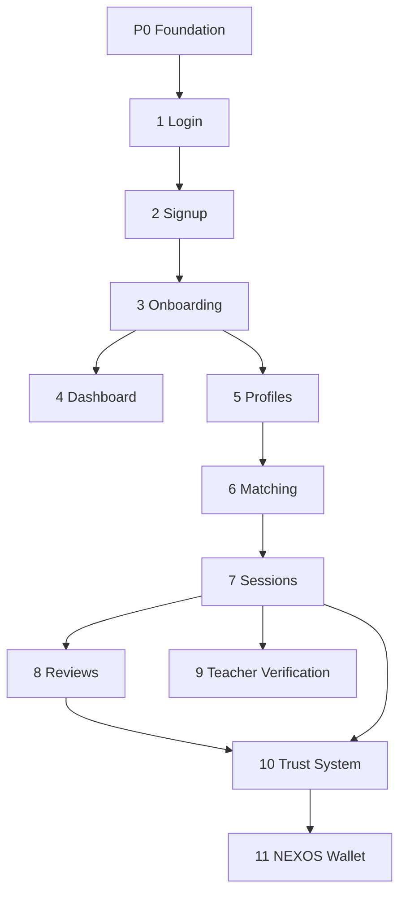

# BUILD_ORDER_V2 — NexoLearn MVP Completion Plan

**Date:** 2026-06-04  
**Based on:** Repository audit (`docs/PROJECT_STATUS.md`), `docs/MVP_V1_SCOPE.md`, `docs/BUILD_PLAN_V1.md`, `docs/API_SPEC_V1.md`, `docs/TRUST_AND_REPUTATION_ENGINE.md`, `docs/ECONOMY_ENGINE_V1.md`  
**Canonical stack:** `apps/web` (Next.js) + `apps/api` (NestJS + Prisma) + Supabase Auth + PostgreSQL  
**Out of scope for this plan:** Legacy `frontend/` and `api/` (quarantine after Phase P0)

This document defines **build order only**. It does not include implementation code.

---

## How to read this document

| Field | Meaning |
|-------|---------|
| **Required files** | Paths to create or materially change |
| **Dependencies** | Other features, services, packages, or env that must exist first |
| **Acceptance criteria** | Testable definition of done |
| **Estimated effort** | Solo developer, familiar with stack (person-days) |
| **Risk level** | Delivery / security / data-integrity risk |

**Effort legend:** S = 0.5–1d · M = 2–4d · L = 5–8d · XL = 9–14d

**Risk legend:** Low · Medium · High · Critical (blocks downstream features)

---

## Master build sequence

Features are numbered in **product priority order** (your list). Technical prerequisites run first.

```
P0 Foundation fixes
  → 1 Login
  → 2 Signup
  → 3 Onboarding
  → 4 Dashboard
  → 5 Profiles
  → 6 Matching
  → 7 Sessions
  → 8 Reviews
  → 9 Teacher Verification
  → 10 Trust System
  → 11 NEXOS Wallet
```

**Parallelization (after P0):** Features 5 (Profiles) can overlap late Onboarding; 9 (Teacher Verification) can start after 7 (Sessions); 10 (Trust) requires 8 (Reviews) and benefits from 9; 11 (NEXOS) requires 7–10 settlement hooks.



---

## Phase P0 — Foundation (blocking all features)

**Goal:** Monorepo compiles, database migrates, auth and API contracts are consistent.

| Attribute | Value |
|-----------|--------|
| **Estimated effort** | M (3–4 person-days) |
| **Risk level** | Critical |

### Required files

| Action | Path |
|--------|------|
| Modify | `apps/api/package.json` — add `@nestjs/config`, `jsonwebtoken`, `@types/jsonwebtoken`; add `"dev": "nest start --watch"`; remove unused `@nestjs/typeorm` |
| Modify | `apps/api/prisma/schema.prisma` — fix `NexosTransaction` → `NexosWallet` relation |
| Create | `apps/api/prisma/migrations/*` — initial migration(s) |
| Create | `pnpm-lock.yaml` (root, via install) |
| Modify | `apps/web/lib/api/client.ts` — parse `ResponseInterceptor` shape (`data.profile`) |
| Modify | `apps/api/src/common/interceptors/response.interceptor.ts` OR document single contract in `docs/API_SPEC_V1.md` |
| Create | `apps/web/middleware.ts` — route protection skeleton |
| Create | `.github/workflows/ci.yml` — lint, type-check, `prisma validate` |
| Archive (move, not delete in plan) | `frontend/`, `api/` → `legacy/` (document in README) |

### Dependencies

- Supabase project with Auth enabled
- PostgreSQL `DATABASE_URL`
- Env files from `apps/api/.env.example`, `apps/web/.env.example`

### Acceptance criteria

- [ ] `pnpm install` succeeds; lockfile committed
- [ ] `pnpm run dev` starts **both** `apps/web` and `apps/api`
- [ ] `prisma migrate dev` applies cleanly; `prisma generate` succeeds
- [ ] `GET http://localhost:3001/health` returns OK
- [ ] API client reads wrapped responses consistently

### Risk notes

Failure to complete P0 causes false negatives on every downstream feature test.

---

## Feature 1 — Login

**Goal:** Authenticated users can sign in and reach the correct post-login route with a valid Supabase session and API-ready JWT.

| Attribute | Value |
|-----------|--------|
| **Estimated effort** | S (1 person-day) — mostly hardening existing UI |
| **Risk level** | Medium |
| **Repository baseline** | `apps/web/app/auth/login/page.tsx`, `apps/web/lib/context/auth-context.tsx` exist |

### Required files

| Action | Path |
|--------|------|
| Modify | `apps/web/app/auth/login/page.tsx` |
| Modify | `apps/web/lib/context/auth-context.tsx` |
| Modify | `apps/web/lib/hooks/useAuth.ts` |
| Create | `apps/web/lib/api/auth.ts` — optional: `POST /api/v1/auth/login` wrapper |
| Create | `apps/web/middleware.ts` — redirect unauthenticated users from protected routes |
| Modify | `apps/web/app/page.tsx` — landing redirect logic |
| Modify | `apps/api/src/modules/auth/auth.controller.ts` — ensure login errors are consistent |
| Modify | `apps/api/src/modules/auth/auth.service.ts` |
| Create | `apps/api/test/auth.e2e-spec.ts` (or `auth.service.spec.ts`) |
| Modify | `apps/web/lib/api/client.ts` — attach `Authorization` helper |

### Dependencies

- **P0** complete
- `NEXT_PUBLIC_SUPABASE_URL`, `NEXT_PUBLIC_SUPABASE_ANON_KEY`
- `SUPABASE_JWT_SECRET` on API (for protected routes after login)

### Acceptance criteria

- [ ] User with valid credentials signs in without console errors
- [ ] Session persists across refresh (Supabase session)
- [ ] Invalid credentials show a clear, non-leaking error message
- [ ] Authenticated user visiting `/auth/login` redirects to `/dashboard` or onboarding gate
- [ ] Unauthenticated user cannot access `/dashboard` (middleware or guard)
- [ ] Access token is available for `Authorization: Bearer` on API calls

### Risks

- Dual auth paths (Supabase-only vs Nest login) if not standardized in P0/Signup (Feature 2)

---

## Feature 2 — Signup

**Goal:** New users register, receive Supabase auth, and **always** get a corresponding application profile in Prisma.

| Attribute | Value |
|-----------|--------|
| **Estimated effort** | M (2–3 person-days) |
| **Risk level** | High |
| **Repository baseline** | Signup UI uses Supabase only; Nest creates profile on `POST /auth/signup` only |

### Required files

| Action | Path |
|--------|------|
| Modify | `apps/web/app/auth/signup/page.tsx` — call Nest signup **or** bootstrap profile after Supabase signup |
| Modify | `apps/web/lib/context/auth-context.tsx` — align `signUp` with chosen flow |
| Create | `apps/web/lib/api/auth.ts` — `signup`, `refresh`, `logout` |
| Modify | `apps/api/src/modules/auth/auth.service.ts` — idempotent profile create; handle email confirmation pending state |
| Modify | `apps/api/src/modules/auth/auth.controller.ts` |
| Modify | `apps/api/src/modules/auth/dto/index.ts` |
| Create | `apps/web/app/auth/callback/page.tsx` — Supabase email confirm / OAuth callback (if enabled) |
| Modify | `apps/api/prisma/schema.prisma` — ensure `Profile.id` = Supabase UUID (no `cuid()` default on id when using external id) |
| Create | `apps/api/prisma/migrations/*` — profile/auth alignment migration if schema changes |
| Optional | Supabase SQL trigger: `on auth.users insert` → stub profile (defense in depth) |

### Dependencies

- **Feature 1** (login path to verify account)
- **P0** (API + Prisma)
- Supabase Auth settings (email confirm on/off documented)

### Acceptance criteria

- [ ] Signup creates Supabase user **and** Prisma `Profile` row with same `id`
- [ ] Duplicate email returns 409-style error, not 500
- [ ] After signup + login, `GET /api/v1/profiles/me` returns profile (not 404)
- [ ] Signup with email confirmation: user sees instructions; post-confirm login works
- [ ] No orphan auth users without profiles in DB (verified by script or test)

### Risks

- **High:** Current split-brain signup (documented in `PROJECT_STATUS.md`)
- Email confirmation UX vs immediate session

---

## Feature 3 — Onboarding

**Goal:** New users complete profile, skills, and learning goals before full product use; onboarding state is enforceable.

| Attribute | Value |
|-----------|--------|
| **Estimated effort** | L (6–8 person-days) |
| **Risk level** | Medium |
| **Repository baseline** | `profile-setup` partial; `skills` / `goals` placeholders |

### Required files

#### Backend

| Action | Path |
|--------|------|
| Create | `apps/api/src/modules/skill/skill.module.ts` |
| Create | `apps/api/src/modules/skill/skill.controller.ts` |
| Create | `apps/api/src/modules/skill/skill.service.ts` |
| Create | `apps/api/src/modules/skill/skill.repository.ts` |
| Create | `apps/api/src/modules/skill/dto/index.ts` |
| Create | `apps/api/src/modules/user-skill/user-skill.module.ts` |
| Create | `apps/api/src/modules/user-skill/user-skill.controller.ts` |
| Create | `apps/api/src/modules/user-skill/user-skill.service.ts` |
| Create | `apps/api/src/modules/user-skill/user-skill.repository.ts` |
| Create | `apps/api/src/modules/goal/goal.module.ts` |
| Create | `apps/api/src/modules/goal/goal.controller.ts` |
| Create | `apps/api/src/modules/goal/goal.service.ts` |
| Create | `apps/api/src/modules/goal/goal.repository.ts` |
| Create | `apps/api/src/modules/onboarding/onboarding.service.ts` — compute completion %/steps |
| Modify | `apps/api/src/app.module.ts` — register modules |
| Modify | `apps/api/prisma/schema.prisma` — optional: `profiles.onboardingCompletedAt`, `onboardingStep` |
| Create | `apps/api/prisma/migrations/*` |
| Modify | `apps/api/prisma/seed.ts` — skill catalog seeds |

#### Frontend

| Action | Path |
|--------|------|
| Modify | `apps/web/app/onboarding/profile-setup/page.tsx` |
| Modify | `apps/web/app/onboarding/skills/page.tsx` |
| Modify | `apps/web/app/onboarding/goals/page.tsx` |
| Create | `apps/web/app/onboarding/page.tsx` — step wizard / progress |
| Create | `apps/web/lib/api/skills.ts` |
| Create | `apps/web/lib/api/goals.ts` |
| Create | `apps/web/lib/hooks/useOnboarding.ts` |
| Create | `apps/web/lib/validations/profile-schema.ts` |
| Create | `apps/web/lib/validations/skill-schema.ts` |
| Create | `apps/web/lib/validations/goal-schema.ts` |
| Create | `apps/web/components/forms/profile-form.tsx` |
| Create | `apps/web/components/forms/skill-form.tsx` |
| Create | `apps/web/components/forms/goal-form.tsx` |
| Modify | `apps/web/middleware.ts` — redirect incomplete onboarding to `/onboarding` |

### Dependencies

- **Features 1–2** (auth + profile row)
- **Feature 5** (Profiles API stable) — partial overlap; profile-setup can use `profiles/me` first
- Prisma models: `Skill`, `UserSkill`, `LearningGoal` (already in schema)
- Reference UX: legacy `frontend/app/onboarding/page.tsx` (teach/learn tags) for product hints only

### Acceptance criteria

- [ ] Wizard flow: profile → skills (≥1) → goals (≥1) → complete
- [ ] User cannot access `/dashboard` until onboarding complete (configurable minimum steps)
- [ ] Skills persisted in `user_skills`; goals in `learning_goals`
- [ ] Re-entering onboarding shows existing data (edit, not blank)
- [ ] API validation rejects empty skill names, invalid goal status, etc.
- [ ] Onboarding completion timestamp or flag stored on profile

### Risks

- Scope creep into full skill taxonomy admin — keep MVP catalog seeded, not user-created global skills unless required

---

## Feature 4 — Dashboard

**Goal:** Authenticated, onboarded users see a actionable home: profile summary, skills/goals, match/session stubs, trust/wallet placeholders.

| Attribute | Value |
|-----------|--------|
| **Estimated effort** | M (3–4 person-days) |
| **Risk level** | Low |
| **Repository baseline** | `apps/web/app/dashboard/page.tsx` exists |

### Required files

| Action | Path |
|--------|------|
| Modify | `apps/web/app/dashboard/page.tsx` |
| Create | `apps/web/components/layout/app-shell.tsx` |
| Create | `apps/web/components/layout/sidebar.tsx` |
| Create | `apps/web/components/layout/topbar.tsx` |
| Create | `apps/web/components/cards/profile-card.tsx` |
| Create | `apps/web/components/cards/match-card.tsx` (empty state until Feature 6) |
| Create | `apps/web/components/cards/session-card.tsx` (empty state until Feature 7) |
| Create | `apps/web/components/widgets/loading-state.tsx` |
| Create | `apps/web/components/widgets/empty-state.tsx` |
| Create | `apps/web/components/widgets/error-state.tsx` |
| Create | `apps/web/lib/hooks/useUserProfile.ts` |
| Create | `apps/api/src/modules/dashboard/dashboard.module.ts` |
| Create | `apps/api/src/modules/dashboard/dashboard.controller.ts` |
| Create | `apps/api/src/modules/dashboard/dashboard.service.ts` — aggregate profile, skills, goals, counts |
| Modify | `apps/api/src/app.module.ts` |
| Create | `apps/web/lib/api/dashboard.ts` |

### Dependencies

- **Features 1–3**
- **Feature 5** for rich profile data (can ship thin dashboard after 3 with profile only)

### Acceptance criteria

- [ ] Dashboard loads in &lt;2s on local with skeleton states
- [ ] Shows user name, onboarding status, skill/goal counts
- [ ] Quick links route to matches, sessions, profile edit, wallet (latter disabled until Feature 11)
- [ ] Sign out works from shell
- [ ] Mobile layout usable (single column)

### Risks

- Low if API aggregation endpoint is bounded (no N+1 queries)

---

## Feature 5 — Profiles

**Goal:** Users manage and discover profiles; public profile pages support matching discovery.

| Attribute | Value |
|-----------|--------|
| **Estimated effort** | M (3–5 person-days) |
| **Risk level** | Medium |
| **Repository baseline** | `ProfileModule` + `profiles.ts` client exist |

### Required files

| Action | Path |
|--------|------|
| Modify | `apps/api/src/modules/profile/profile.controller.ts` — auth rules for list/detail |
| Modify | `apps/api/src/modules/profile/profile.service.ts` |
| Modify | `apps/api/src/modules/profile/profile.repository.ts` |
| Modify | `apps/api/src/modules/profile/dto/index.ts` |
| Modify | `apps/web/lib/api/profiles.ts` |
| Create | `apps/web/app/profiles/[id]/page.tsx` |
| Create | `apps/web/app/settings/page.tsx` |
| Modify | `apps/web/app/onboarding/profile-setup/page.tsx` — dedupe with settings |
| Create | `apps/web/components/cards/profile-card.tsx` (discovery variant) |
| Create | `apps/web/components/forms/profile-form.tsx` (if not from onboarding) |
| Modify | `apps/api/prisma/schema.prisma` — optional: `role` (`learner`/`host`/`both`), `teachingHeadline`, `availability` |
| Create | `apps/api/prisma/migrations/*` |

### Dependencies

- **Features 1–2** (auth)
- **Feature 3** for skills/goals on public profile (read-only joins)
- Supabase Storage (optional) for `avatarUrl` — defer upload to post-MVP if URL-only

### Acceptance criteria

- [ ] `GET/PATCH /api/v1/profiles/me` works with consistent response envelope
- [ ] `GET /api/v1/profiles` supports pagination, search, location filter
- [ ] `GET /api/v1/profiles/:id` returns public-safe fields (no sensitive data)
- [ ] Profile detail page renders skills/goals for other users
- [ ] Settings page updates profile; changes reflect on dashboard
- [ ] Only owner can patch own profile (403 otherwise)

### Risks

- **Medium:** Public profile list without rate limits enables enumeration — add pagination caps in P0 or here

---

## Feature 6 — Matching

**Goal:** Users receive recommendations and manage match requests (pending → accepted/declined/cancelled).

| Attribute | Value |
|-----------|--------|
| **Estimated effort** | L (7–10 person-days) |
| **Risk level** | High |
| **Repository baseline** | `Match` model in Prisma; placeholder `apps/web/app/matches/page.tsx` |

### Required files

#### Backend

| Action | Path |
|--------|------|
| Create | `apps/api/src/modules/match/match.module.ts` |
| Create | `apps/api/src/modules/match/match.controller.ts` |
| Create | `apps/api/src/modules/match/match.service.ts` |
| Create | `apps/api/src/modules/match/match.repository.ts` |
| Create | `apps/api/src/modules/match/matching.algorithm.ts` |
| Create | `apps/api/src/modules/match/dto/index.ts` |
| Modify | `apps/api/src/app.module.ts` |
| Modify | `apps/api/prisma/schema.prisma` — indexes for recommendation queries if needed |

#### Frontend

| Action | Path |
|--------|------|
| Modify | `apps/web/app/matches/page.tsx` |
| Create | `apps/web/app/matches/[id]/page.tsx` |
| Create | `apps/web/lib/api/matches.ts` |
| Create | `apps/web/lib/hooks/useMatches.ts` |
| Create | `apps/web/components/cards/match-card.tsx` |
| Create | `apps/web/components/widgets/filter-panel.tsx` |

### Dependencies

- **Features 3, 5** — skills, goals, profile discovery data
- `ReputationScore` (optional boost) — default scores for new users until Feature 10
- `docs/RECIPROCAL_EXCHANGE_ENGINE.md` for scoring weights

### Acceptance criteria

- [ ] `GET /api/v1/matches/recommendations` returns ranked candidates for authenticated user
- [ ] `POST /api/v1/matches` creates pending match; unique pair constraint enforced
- [ ] `PATCH /api/v1/matches/:id` transitions status with valid state machine only
- [ ] `GET /api/v1/matches/me` lists incoming/outgoing with pagination
- [ ] UI: request, accept, decline, cancel flows work E2E
- [ ] Cannot match self; duplicate requests return 409
- [ ] Expired pending matches handled (cron job or scheduled task documented)

### Risks

- **High:** Algorithm quality and performance; start with deterministic weighted score, not ML
- Cold-start users: require minimum skills/goals before recommendations

---

## Feature 7 — Sessions

**Goal:** Matched (or selected) users schedule exchange sessions, manage participants, statuses, and verification flags.

| Attribute | Value |
|-----------|--------|
| **Estimated effort** | XL (10–14 person-days) |
| **Risk level** | High |
| **Repository baseline** | `ExchangeSession`, `SessionParticipant` models; placeholder sessions page |

### Required files

#### Backend

| Action | Path |
|--------|------|
| Create | `apps/api/src/modules/session/session.module.ts` |
| Create | `apps/api/src/modules/session/session.controller.ts` |
| Create | `apps/api/src/modules/session/session.service.ts` |
| Create | `apps/api/src/modules/session/session.repository.ts` |
| Create | `apps/api/src/modules/session-participant/session-participant.service.ts` |
| Create | `apps/api/src/modules/session/dto/index.ts` |
| Modify | `apps/api/src/app.module.ts` |
| Modify | `apps/api/prisma/schema.prisma` — link session to `matchId` optional; host/learner roles |

#### Frontend

| Action | Path |
|--------|------|
| Modify | `apps/web/app/sessions/page.tsx` |
| Create | `apps/web/app/sessions/[id]/page.tsx` |
| Create | `apps/web/lib/api/sessions.ts` |
| Create | `apps/web/lib/hooks/useSessions.ts` |
| Create | `apps/web/components/forms/session-form.tsx` |
| Create | `apps/web/components/cards/session-card.tsx` |

### Dependencies

- **Feature 6** — accepted match → create session (primary path)
- **Features 1, 5** — participants must be valid profiles
- **Feature 9** — host must be verifiable for premium hosts (soft gate optional until 9)

### Acceptance criteria

- [ ] `POST /api/v1/sessions` creates session with ≥1 host and ≥1 learner participant
- [ ] `PATCH /api/v1/sessions/:id` updates status: `scheduled` → `in_progress` → `completed` / `cancelled` / `no_show`
- [ ] Participant confirmation token flow documented and functional
- [ ] `verificationStatus` on session updates independently of status
- [ ] Only participants or owner can view session detail
- [ ] UI lists upcoming/past sessions; detail shows participants and actions
- [ ] Completing session emits domain event for Reviews / Trust / NEXOS (stub listener acceptable)

### Risks

- **High:** State machine bugs, timezone handling, concurrent status updates
- Settlement side effects must be idempotent for Features 8–11

---

## Feature 8 — Reviews

**Goal:** After completed sessions, participants submit ratings/comments; reviews feed trust and economy.

| Attribute | Value |
|-----------|--------|
| **Estimated effort** | M (4–5 person-days) |
| **Risk level** | Medium |
| **Repository baseline** | `SessionReview` model in Prisma |

### Required files

#### Backend

| Action | Path |
|--------|------|
| Create | `apps/api/src/modules/review/review.module.ts` |
| Create | `apps/api/src/modules/review/review.controller.ts` |
| Create | `apps/api/src/modules/review/review.service.ts` |
| Create | `apps/api/src/modules/review/review.repository.ts` |
| Create | `apps/api/src/modules/review/dto/index.ts` |
| Modify | `apps/api/src/app.module.ts` |

#### Frontend

| Action | Path |
|--------|------|
| Create | `apps/web/app/reviews/[sessionId]/page.tsx` |
| Create | `apps/web/lib/api/reviews.ts` |
| Create | `apps/web/components/forms/review-form.tsx` |

### Dependencies

- **Feature 7** — session in `completed` state
- Participant must be session member to review
- **Feature 10** consumes review events (can stub recalculation)

### Acceptance criteria

- [ ] `POST /api/v1/sessions/:id/reviews` — one review per reviewer per session (unique constraint)
- [ ] Rating 1–5 validated; optional comment length limits
- [ ] `GET /api/v1/sessions/:id/reviews` for participants
- [ ] Reviews only allowed after session completed (422 otherwise)
- [ ] Moderation field `moderation` nullable → `approved` workflow stub
- [ ] UI prompt on dashboard/session detail when review pending

### Risks

- **Medium:** Review bombing — basic rate limit per user/day
- Griefing via negative reviews — addressed in Feature 10 weighting

---

## Feature 9 — Teacher Verification

**Goal:** Users who teach/host can request verification; admins or rules mark profiles as verified hosts; gates premium matching/hosting.

**Note:** Not fully spelled out in `MVP_V1_SCOPE.md`; mapped from `Profile.verified`, `SessionParticipant.role = host`, `docs/FRONTEND_ARCHITECTURE_V1.md` admin verification, and `docs/TRUST_AND_REPUTATION_ENGINE.md` verification bonus.

| Attribute | Value |
|-----------|--------|
| **Estimated effort** | L (5–7 person-days) |
| **Risk level** | High |
| **Repository baseline** | `Profile.verified` boolean only; legacy `profiles.role` in SQL schema |

### Required files

#### Schema

| Action | Path |
|--------|------|
| Modify | `apps/api/prisma/schema.prisma` — add e.g. `TeacherVerificationRequest` (status, evidenceUrl, reviewedBy, reviewedAt) or extend `Profile` with `hostStatus`, `verificationNotes` |
| Create | `apps/api/prisma/migrations/*` |

#### Backend

| Action | Path |
|--------|------|
| Create | `apps/api/src/modules/verification/verification.module.ts` |
| Create | `apps/api/src/modules/verification/verification.controller.ts` |
| Create | `apps/api/src/modules/verification/verification.service.ts` |
| Create | `apps/api/src/modules/verification/verification.repository.ts` |
| Create | `apps/api/src/modules/admin/admin.module.ts` |
| Create | `apps/api/src/modules/admin/admin.controller.ts` — `PATCH /admin/verifications/:id` |
| Create | `apps/api/src/common/auth/roles.guard.ts` |
| Create | `apps/api/src/common/auth/roles.decorator.ts` |
| Modify | `apps/api/src/app.module.ts` |
| Modify | `apps/api/src/modules/session/session.service.ts` — optional: require `verified` for host role |

#### Frontend

| Action | Path |
|--------|------|
| Create | `apps/web/app/verification/apply/page.tsx` |
| Create | `apps/web/app/verification/status/page.tsx` |
| Create | `apps/web/app/admin/teacher-verification/page.tsx` |
| Create | `apps/web/lib/api/verification.ts` |
| Create | `apps/web/lib/api/admin.ts` |

### Dependencies

- **Features 1, 5, 7** — identity, profile, hosting sessions
- Admin role mapping in Supabase metadata or `Profile` role column
- **Feature 10** — verification bonus on trust score

### Acceptance criteria

- [ ] Host can submit verification request with minimum profile completeness (skills, bio, ≥1 completed session optional for MVP)
- [ ] Admin can approve/reject with audit trail (`AuditLog` entry)
- [ ] Approved users have `verified = true` or `hostStatus = verified`
- [ ] Unverified users can still host in MVP **or** product flag blocks host creation — decision documented in env `REQUIRE_VERIFIED_HOST`
- [ ] UI shows verification badge on profile and match cards
- [ ] Non-admin cannot approve verifications (403)

### Risks

- **High:** Manual review queue ops burden; start with MVP manual admin only
- PII in evidence uploads — storage policy required

---

## Feature 10 — Trust System

**Goal:** Reputation and trust scores drive matching weight, review weight, and economy multipliers per `docs/TRUST_AND_REPUTATION_ENGINE.md`.

| Attribute | Value |
|-----------|--------|
| **Estimated effort** | XL (10–12 person-days) |
| **Risk level** | High |
| **Repository baseline** | `ReputationScore` model; no `TrustScore` table |

### Required files

#### Schema

| Action | Path |
|--------|------|
| Modify | `apps/api/prisma/schema.prisma` — add `TrustScore` or extend `ReputationScore` with trust fields; optional `trust_events` ledger |
| Create | `apps/api/prisma/migrations/*` |

#### Backend

| Action | Path |
|--------|------|
| Create | `apps/api/src/modules/reputation/reputation.module.ts` |
| Create | `apps/api/src/modules/reputation/reputation.service.ts` |
| Create | `apps/api/src/modules/reputation/reputation.controller.ts` |
| Create | `apps/api/src/modules/trust/trust.module.ts` |
| Create | `apps/api/src/modules/trust/trust.service.ts` — recalc on review/session events |
| Create | `apps/api/src/modules/contribution/contribution.module.ts` |
| Create | `apps/api/src/modules/contribution/contribution.service.ts` |
| Create | `apps/api/src/modules/contribution/contribution.controller.ts` |
| Modify | `apps/api/src/modules/match/matching.algorithm.ts` — reputation/trust weighting |
| Modify | `apps/api/src/modules/review/review.service.ts` — weighted review handling |
| Modify | `apps/api/src/modules/session/session.service.ts` — emit settlement events |
| Create | `apps/api/src/modules/audit/audit.service.ts` |
| Modify | `apps/api/src/app.module.ts` |

#### Frontend

| Action | Path |
|--------|------|
| Create | `apps/web/app/reputation/page.tsx` |
| Create | `apps/web/app/reputation/leaderboard/page.tsx` |
| Create | `apps/web/app/contribution/page.tsx` |
| Create | `apps/web/lib/api/reputation.ts` |
| Create | `apps/web/lib/api/contribution.ts` |
| Create | `apps/web/components/cards/reputation-card.tsx` |
| Modify | `apps/web/app/dashboard/page.tsx` — trust badges |

### Dependencies

- **Features 7, 8** — session completion + reviews
- **Feature 9** — verification bonus
- `docs/TRUST_AND_REPUTATION_ENGINE.md`, `docs/ECONOMY_ENGINE_V1.md` (contribution formulas)

### Acceptance criteria

- [ ] `GET /api/v1/reputation/me` returns score, level, review counts
- [ ] `GET /api/v1/reputation/leaderboard` paginated
- [ ] Trust/recalculation runs on: session completed, review approved (idempotent)
- [ ] New users receive baseline reputation (~30 per trust doc)
- [ ] Matching recommendations incorporate reputation/trust weight
- [ ] Contribution balance updates on verified session per MVP formula (simplified acceptable)
- [ ] Dashboard shows reputation level and contribution balance
- [ ] Abuse: duplicate recalculation does not double-apply points

### Risks

- **High:** Formula complexity vs delivery time — ship **MVP subset** (reputation from avg rating + completion rate only)
- Overfitting trust to NEXOS before Feature 11 — keep ledgers separate

---

## Feature 11 — NEXOS Wallet

**Goal:** Internal wallet: balance, transaction history, mint on rewards, transfer/spend with balance checks.

| Attribute | Value |
|-----------|--------|
| **Estimated effort** | L (8–10 person-days) |
| **Risk level** | Critical (financial integrity) |
| **Repository baseline** | `NexosWallet`, `NexosTransaction` models (schema relation must be fixed in P0) |

### Required files

#### Backend

| Action | Path |
|--------|------|
| Modify | `apps/api/prisma/schema.prisma` — fix wallet relation; transaction types enum |
| Create | `apps/api/prisma/migrations/*` |
| Create | `apps/api/src/modules/nexos/nexos.module.ts` |
| Create | `apps/api/src/modules/nexos/nexos.service.ts` — atomic transfers (DB transaction) |
| Create | `apps/api/src/modules/nexos/nexos.controller.ts` |
| Create | `apps/api/src/modules/nexos/nexos.repository.ts` |
| Create | `apps/api/src/modules/economy/economy.service.ts` — mint rules post-session |
| Modify | `apps/api/src/modules/session/session.service.ts` — trigger mint/settlement |
| Modify | `apps/api/src/modules/admin/admin.controller.ts` — `POST /admin/adjustments/nexos` |
| Modify | `apps/api/src/modules/audit/audit.service.ts` |

#### Frontend

| Action | Path |
|--------|------|
| Create | `apps/web/app/nexos/page.tsx` |
| Create | `apps/web/app/nexos/transfer/page.tsx` |
| Create | `apps/web/lib/api/nexos.ts` |
| Create | `apps/web/lib/hooks/useWallet.ts` |
| Create | `apps/web/components/cards/wallet-card.tsx` |
| Create | `apps/web/components/forms/transfer-form.tsx` |
| Modify | `apps/web/app/dashboard/page.tsx` |

### Dependencies

- **P0** — Prisma schema fix for `NexosTransaction`
- **Features 7, 10** — verified session + reputation multipliers for mint
- `docs/ECONOMY_ENGINE_V1.md`, `docs/NEXOS_ECONOMY_DESIGN.md`
- Wallet created on profile signup (seed zero balance)

### Acceptance criteria

- [ ] Wallet auto-created for each profile at signup
- [ ] `GET /api/v1/nexos/me` — balance + lifetime earned
- [ ] `GET /api/v1/nexos/me/transactions` — paginated history
- [ ] `POST /api/v1/nexos/transfer` — atomic debit/credit; insufficient funds → 409
- [ ] `POST /api/v1/nexos/spend` — defined spend sinks (e.g. premium match boost)
- [ ] Session completion mints NEXOS once per participant rules (idempotent)
- [ ] Admin adjustment writes `AuditLog` + transaction row
- [ ] No negative balances; concurrent transfers safe (transaction isolation)
- [ ] UI shows balance, history, transfer form with validation

### Risks

- **Critical:** Double-spend / race conditions without DB transactions
- Inflation if mint rules too generous — cap per `ECONOMY_ENGINE_V1.md`

---

## Cross-cutting deliverables (run throughout)

| Deliverable | Files / actions | When |
|-------------|-----------------|------|
| API contract | Align `response.interceptor.ts` + all `apps/web/lib/api/*.ts` | P0, Feature 5 |
| Types package (optional) | `packages/types/` shared DTOs | After Feature 5 |
| Tests | `*.spec.ts`, Playwright E2E | After each feature |
| RLS (Supabase) | SQL policies for Prisma tables if using Supabase Postgres | P0 + Feature 5 |
| Rate limiting | `@nestjs/throttler` | Feature 1–2 |
| CI | `.github/workflows/ci.yml` | P0 |

---

## Summary table

| # | Feature | Effort | Risk | Depends on |
|---|---------|--------|------|------------|
| P0 | Foundation | M (3–4d) | Critical | — |
| 1 | Login | S (1d) | Medium | P0 |
| 2 | Signup | M (2–3d) | High | P0, 1 |
| 3 | Onboarding | L (6–8d) | Medium | 1, 2 |
| 4 | Dashboard | M (3–4d) | Low | 1–3 |
| 5 | Profiles | M (3–5d) | Medium | 1–2 |
| 6 | Matching | L (7–10d) | High | 3, 5 |
| 7 | Sessions | XL (10–14d) | High | 6 |
| 8 | Reviews | M (4–5d) | Medium | 7 |
| 9 | Teacher Verification | L (5–7d) | High | 5, 7 |
| 10 | Trust System | XL (10–12d) | High | 7, 8, 9 |
| 11 | NEXOS Wallet | L (8–10d) | Critical | P0, 7, 10 |

**Total estimated effort (sequential):** ~62–88 person-days (~13–18 weeks at 5 days/week solo).  
**With overlap (2 tracks):** ~10–14 weeks (e.g. UI components while API modules progress).

---

## MVP complete definition (BUILD_ORDER_V2)

MVP is complete when all acceptance criteria for **P0 + Features 1–11** pass in staging, with:

- Single canonical stack (`apps/web` + `apps/api`)
- One database schema (Prisma migrations applied)
- E2E smoke: signup → onboarding → dashboard → match → session → review → verification (optional path) → trust metrics visible → NEXOS transfer
- No Critical-risk items open for login, signup, profile integrity, or wallet atomicity

---

## References

- `docs/PROJECT_STATUS.md` — current gaps
- `docs/BUILD_PLAN_V1.md` — original sprint breakdown
- `docs/MVP_V1_SCOPE.md` — product scope
- `docs/API_SPEC_V1.md` — endpoint contracts
- `docs/TRUST_AND_REPUTATION_ENGINE.md` — Feature 10 design
- `docs/ECONOMY_ENGINE_V1.md` — Features 10–11
