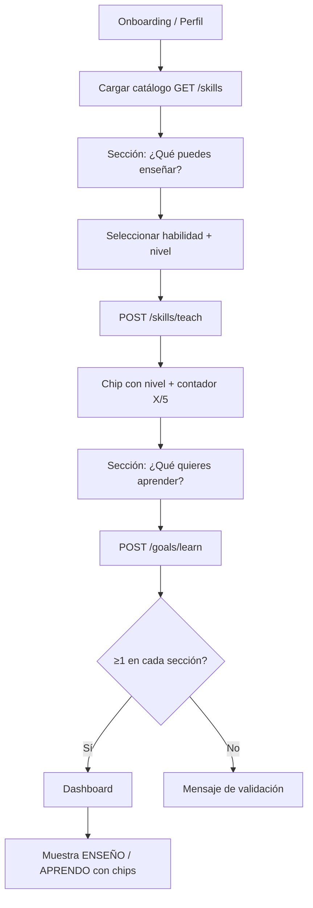

# NexoLearn — Skills & Goals V1

**Fecha:** 2026-06-05  
**Estado:** Implementado  
**Objetivo:** Base del Match Engine — cada usuario declara habilidades que enseña y objetivos que quiere aprender.

---

## 1. Resumen

Skills & Goals V1 introduce un modelo normalizado con catálogo de habilidades, niveles por tipo y API REST. Los datos quedan listos para matching futuro (Usuario A enseña X, Usuario B aprende X).

| Área | Implementación |
|------|----------------|
| Base de datos | `skills`, `user_teach_skills`, `user_learning_goals` |
| API | Next.js Route Handlers en `frontend/app/api/` |
| UI | Onboarding + Dashboard (`frontend/`) |
| Idioma | Español |
| Validación | 1–5 ítems, sin duplicados, sin `alert()` |

---

## 2. Estructura de base de datos

### `skills` (catálogo)

| Campo | Tipo | Descripción |
|-------|------|-------------|
| `id` | UUID PK | Identificador |
| `name` | TEXT | Nombre visible |
| `name_normalized` | TEXT UNIQUE | Minúsculas normalizadas (anti-duplicados) |
| `category` | TEXT | Categoría opcional |
| `created_at` | TIMESTAMPTZ | Alta |

### `user_teach_skills`

| Campo | Tipo | Descripción |
|-------|------|-------------|
| `id` | UUID PK | Identificador |
| `user_id` | UUID FK → `profiles` | Usuario |
| `skill_id` | UUID FK → `skills` | Habilidad del catálogo |
| `level` | TEXT | `basico`, `intermedio`, `avanzado` |
| `created_at` | TIMESTAMPTZ | Alta |

**Constraint:** `UNIQUE(user_id, skill_id)`

### `user_learning_goals`

| Campo | Tipo | Descripción |
|-------|------|-------------|
| `id` | UUID PK | Identificador |
| `user_id` | UUID FK → `profiles` | Usuario |
| `skill_id` | UUID FK → `skills` | Habilidad objetivo |
| `level` | TEXT | `principiante`, `intermedio`, `avanzado` |
| `created_at` | TIMESTAMPTZ | Alta |

**Constraint:** `UNIQUE(user_id, skill_id)`

### Migración

Aplicar en Supabase SQL Editor:

```
api/migrations/2026-06-05-skills-goals-v1.sql
```

Incluye RLS, índices y seed de 15 habilidades iniciales.

### Preparación Match Engine

```text
user_teach_skills.skill_id  ←→  user_learning_goals.skill_id
         (mismo skill_id = potencial match teach/learn)
```

Sin lógica de matching en V1; solo datos normalizados y consultables.

---

## 3. Niveles

### Enseñar (`user_teach_skills.level`)

| Valor DB | UI |
|----------|-----|
| `basico` | Básico |
| `intermedio` | Intermedio |
| `avanzado` | Avanzado |

### Aprender (`user_learning_goals.level`)

| Valor DB | UI |
|----------|-----|
| `principiante` | Principiante |
| `intermedio` | Intermedio |
| `avanzado` | Avanzado |

---

## 4. API

Autenticación: `Authorization: Bearer <supabase_access_token>`

Rewrites en `next.config.ts` exponen rutas limpias:

| Método | Ruta pública | Handler |
|--------|--------------|---------|
| GET | `/skills` | Catálogo (`?q=` búsqueda opcional) |
| GET | `/skills/teach` | Habilidades del usuario *(soporte UI)* |
| POST | `/skills/teach` | Agregar habilidad para enseñar |
| DELETE | `/skills/teach/:id` | Eliminar habilidad |
| GET | `/goals` | Objetivos del usuario |
| POST | `/goals/learn` | Agregar objetivo |
| DELETE | `/goals/learn/:id` | Eliminar objetivo |

### POST `/skills/teach`

```json
{
  "skill_id": "uuid-opcional",
  "skill_name": "Guitarra",
  "level": "intermedio"
}
```

- `skill_id` o `skill_name` (crea en catálogo si no existe, sin duplicar por `name_normalized`)
- `level` obligatorio

### POST `/goals/learn`

```json
{
  "skill_id": "uuid-opcional",
  "skill_name": "Inglés",
  "level": "principiante"
}
```

### Respuestas de error (ejemplos)

| Código | Mensaje |
|--------|---------|
| 400 | Máximo 5 habilidades para enseñar. |
| 400 | Máximo 5 objetivos de aprendizaje. |
| 409 | Ya agregaste esta habilidad. |
| 409 | Ya agregaste este objetivo. |
| 401 | No autorizado. |

---

## 5. Reglas de validación

| Regla | Enseñar | Aprender |
|-------|---------|----------|
| Mínimo | 1 | 1 |
| Máximo | 5 | 5 |
| Duplicados | Bloqueado por `UNIQUE(user_id, skill_id)` | Igual |
| Catálogo | `name_normalized` evita duplicados de texto libre | Igual |
| Niveles | Solo valores permitidos en CHECK | Solo valores permitidos |

---

## 6. Flujo de UI



### Onboarding (`/onboarding`)

- Paso 3 de 4 (activación)
- Componente `SkillsGoalsEditor`
- Contador `0/5` por sección
- Botones: «Agregar habilidad», «Agregar objetivo»
- «Guardar y continuar» → `/dashboard`

### Dashboard (`/dashboard`)

- Bloque **Enseño** con chips y nivel
- Bloque **Aprendo** con chips y nivel
- Mensajes vacíos según especificación
- Perfil % calculado con conteo de teach/goals

---

## 7. Archivos

| Archivo | Rol |
|---------|-----|
| `api/migrations/2026-06-05-skills-goals-v1.sql` | Schema + RLS + seed |
| `frontend/lib/skills-types.ts` | Tipos y etiquetas |
| `frontend/lib/api-auth.ts` | Auth en Route Handlers |
| `frontend/lib/api/skills-db.ts` | Lógica catálogo y validación |
| `frontend/lib/api/skills-client.ts` | Cliente fetch |
| `frontend/app/api/skills/**` | Endpoints teach + catálogo |
| `frontend/app/api/goals/**` | Endpoints learn |
| `frontend/components/skills/SkillChip.tsx` | Chip con nivel |
| `frontend/components/skills/SkillsGoalsEditor.tsx` | Editor onboarding/perfil |
| `frontend/app/onboarding/page.tsx` | Onboarding V1 |
| `frontend/app/dashboard/page.tsx` | Integración dashboard |
| `frontend/next.config.ts` | Rewrites `/skills`, `/goals` |

---

## 8. Criterios de aceptación

| # | Criterio | Estado |
|---|----------|--------|
| 1 | Usuario puede agregar habilidades para enseñar | ✅ |
| 2 | Usuario puede agregar objetivos de aprendizaje | ✅ |
| 3 | Máximo 5 en cada categoría | ✅ |
| 4 | Niveles almacenados correctamente | ✅ |
| 5 | Dashboard muestra ENSEÑO y APRENDO | ✅ |
| 6 | Sin duplicados por usuario/skill | ✅ |
| 7 | Mensajes en español, sin `alert()` | ✅ |
| 8 | Build pasa | Verificar con `npm run build` |
| 9 | Listo para Match Engine V1 | ✅ (modelo normalizado) |

---

## 9. Despliegue

1. Ejecutar migración SQL en Supabase.
2. Verificar RLS activo en las tres tablas.
3. `cd frontend && npm run build && npm run dev`
4. Flujo de prueba: registro → onboarding → agregar 1 teach + 1 learn → dashboard.

---

## 10. Próximo paso (Match Engine V1)

Consulta base para matching:

```sql
SELECT teach.user_id AS teacher_id, learn.user_id AS learner_id, s.name
FROM user_teach_skills teach
JOIN user_learning_goals learn ON teach.skill_id = learn.skill_id
JOIN skills s ON s.id = teach.skill_id
WHERE teach.user_id <> learn.user_id;
```

Implementar en Sprint 3 como servicio de recomendaciones.
